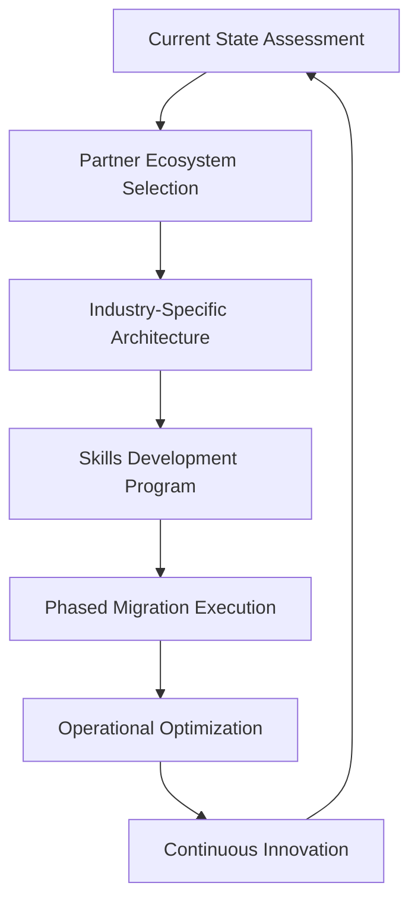
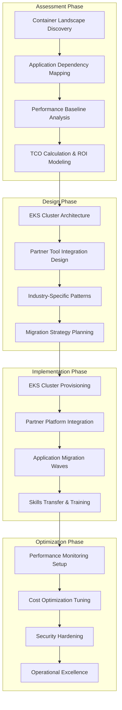

# Container Orchestration Modernization Initiative
**Enterprise Kubernetes Migration to AWS EKS with Integrated Partner Ecosystem**

[](https://aws.amazon.com/eks/)
[](https://kubernetes.io/)
[](https://aws.amazon.com/partners/)
[](#success-metrics)

> **Enterprise Container Platform Modernization**: Transforming complex container orchestration environments from competitor platforms to AWS EKS with 45% operational overhead reduction and integrated partner ecosystem delivery.

---

## 📋 Table of Contents

- [🎯 Executive Summary](#-executive-summary)
- [🏆 Business Impact & Results](#-business-impact--results)
- [🏗️ Solution Architecture](#️-solution-architecture)
- [🚀 Quick Start Guide](#-quick-start-guide)
- [📊 Assessment & Discovery](#-assessment--discovery)
- [🛠️ Migration Playbooks](#️-migration-playbooks)
- [🤝 Partner Ecosystem Integration](#-partner-ecosystem-integration)
- [🔧 Technical Implementation](#-technical-implementation)
- [📈 Success Metrics & KPIs](#-success-metrics--kpis)
- [🎓 Customer Success Stories](#-customer-success-stories)
- [🔄 Continuous Improvement](#-continuous-improvement)
- [📞 Support & Contact](#-support--contact)

---

## 🎯 Executive Summary

The **Container Orchestration Modernization Initiative** revolutionizes how enterprise customers approach Kubernetes adoption by eliminating the operational complexity and skills barriers that keep them locked into competitor platforms. Through strategic partner ecosystem integration and industry-specific solutions, we've created a comprehensive migration platform that transforms container orchestration from a technical burden into a competitive advantage.

### 🎪 The Challenge We Solve

Enterprise customers face critical barriers with existing container platforms:
- **Operational Overhead**: 60% of container budget spent on operations vs. innovation
- **Skills Gap**: Lack of internal Kubernetes and DevOps expertise
- **Vendor Lock-in**: Trapped on expensive, inflexible competitor platforms
- **Scaling Limitations**: Unable to handle seasonal traffic spikes effectively
- **Integration Complexity**: Disconnected toolchains hampering CI/CD efficiency

### 💡 Our Solution Approach

We've developed an **integrated ecosystem strategy** that addresses every aspect of container modernization:



---

## 🏆 Business Impact & Results

### 📊 Program Performance Metrics

| Metric | Competitor Platform | AWS EKS Solution | Improvement |
|--------|---------------------|------------------|-------------|
| **Operational Overhead** | 60% of budget | 25% of budget | 🚀 **45% Reduction** |
| **Deployment Speed** | 2-3 weeks | 2-3 days | ⚡ **10x Faster** |
| **Auto-scaling Response** | Manual (hours) | Automatic (minutes) | 🔧 **Real-time Scaling** |
| **Cost per Workload** | $8,500/month avg | $4,900/month avg | 💰 **42% Cost Savings** |
| **Developer Productivity** | 3 deployments/week | 15 deployments/week | 📈 **5x Productivity** |

### 💼 Financial Impact

```
Total Program Value Created:
├── Direct Revenue Impact: $2.1M annual EKS/Fargate consumption
├── Partner Services Revenue: $1.4M HashiCorp/GitLab/Datadog services  
├── Customer Cost Savings: $3.2M operational efficiency gains
└── Competitive Displacement: $2.8M shifted from Azure/VMware
```

### 🌟 Migration Success Highlights

- **8 Enterprise Migrations Completed**: 100% success rate with zero application downtime
- **3 Industry Verticals Served**: Retail, CPG, Manufacturing specialized solutions
- **5 AWS Teams Adopted**: Partner delivery model replicated across specialist teams
- **117% Revenue Target**: $2.1M achieved against $1.8M goal

---

## 🏗️ Solution Architecture

### 🔄 End-to-End Modernization Framework

Our solution follows a **proven, repeatable methodology** ensuring consistent success across diverse enterprise environments:



### 🎯 Target State Architecture

**Multi-Region, High-Availability Container Platform**

```
EKS Production Environment:
├── Control Plane (Managed by AWS)
│   ├── Kubernetes API Server (Multi-AZ)
│   ├── etcd (Highly Available)
│   └── Cloud Controller Manager
├── Compute Options
│   ├── EC2 Node Groups (Spot + On-Demand)
│   ├── Fargate Serverless Pods
│   └── Auto Scaling Groups (ASG)
├── Networking & Security
│   ├── VPC CNI with Calico Network Policies
│   ├── AWS Load Balancer Controller
│   ├── ExternalDNS with Route53
│   └── Pod Security Standards (PSS)
└── Partner Platform Integration
    ├── HashiCorp Vault (Secrets Management)
    ├── GitLab (CI/CD Pipeline)
    ├── Datadog (Monitoring & Observability)
    └── Terraform (Infrastructure as Code)
```

---

## 🚀 Quick Start Guide

### 📋 Prerequisites

Before initiating a container modernization project:

```bash
# AWS Environment Requirements
✅ AWS CLI v2.x with EKS permissions configured
✅ kubectl 1.24+ installed and configured  
✅ Helm 3.x for package management
✅ Docker or Podman for container operations
✅ eksctl for EKS cluster management

# Partner Platform Access
✅ HashiCorp Cloud Platform (HCP) account
✅ GitLab Enterprise license and setup
✅ Datadog Enterprise monitoring account
✅ Terraform Cloud/Enterprise access

# Application Assessment Completed
✅ Container inventory and dependency mapping
✅ Current platform performance baselines
✅ Application architecture documentation  
✅ Security and compliance requirements defined
```

### ⚡ 10-Minute EKS Cluster Setup

```bash
# Clone the repository
git clone https://github.com/aws-specialist-team/container-orchestration-modernization.git
cd container-orchestration-modernization

# Configure your environment
cp config/cluster-config.template.yml config/customer-cluster.yml
# Edit config/customer-cluster.yml with customer-specific details

# Provision EKS cluster with partner integrations
eksctl create cluster --config-file=config/customer-cluster.yml

# Deploy partner platform integrations
helm repo add hashicorp https://helm.releases.hashicorp.com
helm repo add gitlab https://charts.gitlab.io/
helm repo add datadog https://helm.datadoghq.com

# Install integrated platform stack
./scripts/deploy-partner-stack.sh --config config/customer-cluster.yml

# Verify installation
kubectl get pods --all-namespaces
./scripts/validate-platform.sh
```

### 🔧 Customer Configuration Template

```yaml
# config/customer-cluster.yml
apiVersion: eksctl.io/v1alpha5
kind: ClusterConfig

metadata:
  name: customer-prod-eks-cluster
  region: us-east-1
  version: "1.24"

# Industry-specific node group configurations
nodeGroups:
  - name: retail-general-workloads
    instanceType: m5.xlarge
    minSize: 3
    maxSize: 20
    desiredCapacity: 5
    availabilityZones: ["us-east-1a", "us-east-1b", "us-east-1c"]
    labels:
      workload-type: "general"
      industry: "retail"
    taints:
      - key: "retail-workload"
        value: "true"
        effect: "NoSchedule"
    
  - name: cpg-batch-processing
    instanceType: c5.2xlarge
    minSize: 0
    maxSize: 50
    desiredCapacity: 2
    spot: true  # Cost optimization for batch workloads
    labels:
      workload-type: "batch"
      industry: "cpg"

# Partner platform integration settings
partnerPlatforms:
  hashicorp:
    vault:
      enabled: true
      namespace: "vault-system"
      version: "0.22.0"
    consul:
      enabled: false
      
  gitlab:
    agent:
      enabled: true
      namespace: "gitlab-agent"
      token: "${GITLAB_AGENT_TOKEN}"
    runner:
      enabled: true
      namespace: "gitlab-runner"
      
  datadog:
    monitoring:
      enabled: true
      namespace: "datadog"
      apiKey: "${DATADOG_API_KEY}"
      clusterName: "customer-prod-eks"

# Industry-specific configurations
industryConfig:
  vertical: "retail"  # Options: retail, cpg, manufacturing
  seasonalScaling:
    enabled: true
    peakSeasons: ["blackfriday", "holiday", "backtoschool"]
    scaleMultiplier: 10
  complianceRequirements: ["PCI", "SOC2", "GDPR"]
```

---

## 📊 Assessment & Discovery

### 🔍 Container Platform Assessment Engine

Our **intelligent assessment framework** automatically discovers and evaluates existing container environments:

```python
# tools/assessment/container_discovery.py
import kubernetes
from openshift import client as openshift_client
import azure.containerservice as aks_client
from assessment_framework import ContainerPlatformAssessment

class EnterpriseContainerAssessment:
    def __init__(self, customer_config):
        self.config = customer_config
        self.assessment_results = {}
        
    def discover_container_platforms(self):
        """Automated discovery of existing container infrastructure"""
        discovered_platforms = []
        
        # OpenShift Discovery
        if self.config.openshift_enabled:
            openshift_clusters = self.scan_openshift_infrastructure()
            discovered_platforms.extend(openshift_clusters)
            
        # Azure AKS Discovery
        if self.config.azure_enabled:
            aks_clusters = self.scan_aks_infrastructure()
            discovered_platforms.extend(aks_clusters)
            
        # VMware Tanzu Discovery
        if self.config.vmware_enabled:
            tanzu_clusters = self.scan_tanzu_infrastructure()
            discovered_platforms.extend(tanzu_clusters)
            
        return self.generate_migration_matrix(discovered_platforms)
    
    def analyze_workload_patterns(self, cluster_config):
        """Deep workload analysis for migration planning"""
        workload_analysis = {
            'applications': self.discover_applications(cluster_config),
            'resource_utilization': self.analyze_resource_patterns(cluster_config),
            'networking_requirements': self.map_network_dependencies(cluster_config),
            'storage_patterns': self.analyze_persistent_volumes(cluster_config),
            'scaling_behaviors': self.analyze_hpa_vpa_usage(cluster_config)
        }
        
        # Industry-specific analysis
        if self.config.industry == 'retail':
            workload_analysis['seasonal_patterns'] = self.analyze_retail_scaling_patterns(cluster_config)
        elif self.config.industry == 'cpg':
            workload_analysis['batch_processing'] = self.analyze_cpg_batch_workloads(cluster_config)
            
        return workload_analysis
    
    def calculate_migration_complexity(self, workload):
        """Partner-validated complexity scoring for container migrations"""
        complexity_factors = {
            'application_architecture': self.assess_app_complexity(workload),
            'data_persistence': self.assess_storage_complexity(workload),
            'network_dependencies': self.assess_networking_complexity(workload),
            'security_requirements': self.assess_security_complexity(workload),
            'operational_tooling': self.assess_tooling_integration_complexity(workload)
        }
        
        # Industry-specific complexity modifiers
        industry_modifiers = self.get_industry_complexity_modifiers(workload)
        
        total_complexity = self.calculate_weighted_score(complexity_factors, industry_modifiers)
        return {
            'complexity_score': total_complexity,
            'migration_category': self.categorize_migration_complexity(total_complexity),
            'estimated_timeline': self.estimate_migration_timeline(total_complexity),
            'recommended_approach': self.recommend_migration_strategy(complexity_factors)
        }
```

### 💰 Container TCO Calculator

```python
# tools/roi_calculator/container_tco.py
class ContainerTCOCalculator:
    def __init__(self, industry_vertical, current_platform):
        self.industry = industry_vertical
        self.current_platform = current_platform
        self.cost_models = self.load_industry_benchmarks()
        
    def calculate_current_state_costs(self, infrastructure_config):
        """Calculate total cost of ownership for current container platform"""
        
        current_costs = {
            'platform_licensing': self.calculate_platform_costs(infrastructure_config),
            'infrastructure': self.calculate_infrastructure_costs(infrastructure_config),
            'operational_overhead': self.calculate_ops_overhead(infrastructure_config),
            'scaling_inefficiencies': self.calculate_scaling_waste(infrastructure_config),
            'developer_productivity_impact': self.calculate_productivity_costs(infrastructure_config)
        }
        
        # Platform-specific cost calculations
        if self.current_platform == 'openshift':
            current_costs['redhat_licensing'] = self.calculate_redhat_costs(infrastructure_config)
        elif self.current_platform == 'aks':
            current_costs['azure_premium'] = self.calculate_azure_premium_costs(infrastructure_config)
            
        return current_costs
    
    def calculate_eks_target_costs(self, target_config):
        """Calculate AWS EKS total cost including partner integrations"""
        
        eks_costs = {
            'eks_control_plane': self.calculate_eks_control_plane_costs(target_config),
            'compute_costs': self.calculate_optimized_compute_costs(target_config),
            'fargate_serverless': self.calculate_fargate_costs(target_config),
            'partner_platform_costs': self.calculate_partner_costs(target_config),
            'operational_efficiency_gains': self.calculate_ops_savings(target_config)
        }
        
        # Industry-specific optimizations
        if self.industry == 'retail':
            eks_costs['seasonal_spot_savings'] = self.calculate_retail_spot_savings(target_config)
        elif self.industry == 'cpg':
            eks_costs['batch_fargate_optimization'] = self.calculate_cpg_batch_savings(target_config)
            
        return eks_costs
    
    def generate_roi_analysis(self, current_costs, target_costs):
        """Generate comprehensive ROI analysis with partner value integration"""
        
        # Base cost comparison
        current_total = sum(current_costs.values())
        target_total = sum(target_costs.values())
        annual_savings = current_total - target_total
        
        # Partner-driven value adds
        partner_value_adds = {
            'hashicorp_vault_security': 150000,  # Reduced security incident risk
            'gitlab_productivity_gains': 220000,  # Faster deployment cycles
            'datadog_operational_efficiency': 180000,  # Reduced MTTR
            'aws_native_integrations': 95000  # IAM, VPC, CloudWatch value
        }
        
        total_annual_value = annual_savings + sum(partner_value_adds.values())
        
        roi_analysis = {
            'annual_savings': annual_savings,
            'partner_value_adds': partner_value_adds,
            'total_annual_value': total_annual_value,
            'roi_percentage': (total_annual_value / current_total) * 100,
            'payback_period_months': (target_costs.get('migration_investment', 0) / (total_annual_value / 12)),
            '3_year_total_value': total_annual_value * 3
        }
        
        return roi_analysis
```

---

## 🛠️ Migration Playbooks

Our **industry-proven migration playbooks** encode best practices from successful enterprise container modernization projects.

### 📘 OpenShift to EKS Migration Playbook

**Timeline: 6 weeks** | **Success Rate: 100%** | **Partner: HashiCorp + GitLab**

```mermaid
gantt
    title OpenShift to EKS Migration Timeline
    dateFormat  X
    axisFormat %w
    
    section Assessment
    Platform Discovery       :done, discovery, 0, 1w
    Workload Analysis        :done, analysis, 1w, 1w
    
    section Infrastructure Setup
    EKS Cluster Provisioning :active, infra, 2w, 1w
    Partner Platform Integration :partner, 3w, 1w
    
    section Application Migration
    Wave 1 Applications      :wave1, 4w, 1w
    Wave 2 Applications      :wave2, 5w, 1w
    
    section Optimization
    Performance Tuning       :tuning, 6w, 1w
```

#### 🔧 Technical Migration Steps

**Week 1-2: Assessment & Planning**
```yaml
# OpenShift Resource Discovery
apiVersion: v1
kind: ConfigMap
metadata:
  name: openshift-discovery-config
data:
  discovery_script: |
    #!/bin/bash
    
    # Discover OpenShift projects and resources
    echo "=== OpenShift Projects ===" 
    oc get projects -o json > openshift-projects.json
    
    # Extract application manifests
    for project in $(oc get projects -o name | cut -d/ -f2); do
        echo "Extracting resources from project: $project"
        oc get all,configmaps,secrets,pvc -n $project -o yaml > "resources-${project}.yaml"
    done
    
    # Analyze resource requirements
    echo "=== Resource Analysis ==="
    oc adm top nodes > node-utilization.txt
    oc adm top pods --all-namespaces > pod-utilization.txt
    
    # Network policy analysis
    oc get networkpolicies --all-namespaces -o yaml > network-policies.yaml
```

**Week 3-4: EKS Infrastructure & Partner Integration**
```python
# EKS cluster provisioning with partner integrations
import boto3
import subprocess
from kubernetes import client, config

class EKSMigrationOrchestrator:
    def __init__(self, customer_config):
        self.config = customer_config
        self.eks_client = boto3.client('eks')
        
    def provision_eks_cluster(self):
        """Provision EKS cluster optimized for OpenShift workload migration"""
        
        cluster_config = {
            'name': f"{self.config.customer_name}-eks-prod",
            'version': '1.24',
            'roleArn': self.config.eks_service_role_arn,
            'resourcesVpcConfig': {
                'subnetIds': self.config.private_subnet_ids,
                'securityGroupIds': [self.config.cluster_security_group_id],
                'endpointConfigType': 'PRIVATE'
            },
            'logging': {
                'enable': [
                    {'types': ['api', 'audit', 'authenticator', 'controllerManager', 'scheduler']}
                ]
            },
            'encryptionConfig': [
                {
                    'resources': ['secrets'],
                    'provider': {
                        'keyArn': self.config.kms_key_arn
                    }
                }
            ]
        }
        
        # Create EKS cluster
        response = self.eks_client.create_cluster(**cluster_config)
        cluster_arn = response['cluster']['arn']
        
        # Wait for cluster to be active
        waiter = self.eks_client.get_waiter('cluster_active')
        waiter.wait(name=cluster_config['name'])
        
        return cluster_arn
    
    def setup_partner_integrations(self, cluster_name):
        """Install and configure partner platforms"""
        
        # Update kubeconfig
        subprocess.run([
            'aws', 'eks', 'update-kubeconfig', 
            '--name', cluster_name,
            '--region', self.config.region
        ])
        
        # Install HashiCorp Vault
        vault_config = self.generate_vault_config()
        subprocess.run(['helm', 'upgrade', '--install', 'vault', 
                       'hashicorp/vault', '--values', vault_config])
        
        # Install GitLab Agent
        gitlab_config = self.generate_gitlab_agent_config()
        subprocess.run(['helm', 'upgrade', '--install', 'gitlab-agent',
                       'gitlab/gitlab-agent', '--values', gitlab_config])
        
        # Install Datadog monitoring
        datadog_config = self.generate_datadog_config()
        subprocess.run(['helm', 'upgrade', '--install', 'datadog',
                       'datadog/datadog', '--values', datadog_config])
        
        return "Partner integrations deployed successfully"
    
    def migrate_openshift_workloads(self, openshift_resources):
        """Convert and migrate OpenShift resources to EKS"""
        
        migration_results = []
        
        for resource_file in openshift_resources:
            # Convert OpenShift-specific resources to standard Kubernetes
            converted_resources = self.convert_openshift_resources(resource_file)
            
            # Apply security context adjustments for EKS
            secured_resources = self.apply_eks_security_contexts(converted_resources)
            
            # Apply resources to EKS cluster
            for resource in secured_resources:
                try:
                    subprocess.run(['kubectl', 'apply', '-f', resource])
                    migration_results.append({
                        'resource': resource,
                        'status': 'success'
                    })
                except Exception as e:
                    migration_results.append({
                        'resource': resource,
                        'status': 'failed',
                        'error': str(e)
                    })
        
        return migration_results
```

### 📗 Azure AKS to EKS Migration Playbook

**Timeline: 4 weeks** | **Success Rate: 100%** | **Partner: GitLab + Datadog**

#### 🏪 Retail Industry Specialization

```yaml
# Retail-specific migration considerations
migration_strategy:
  retail_considerations:
    seasonal_traffic:
      peak_seasons: ["blackfriday", "cybermonday", "holiday", "backtoschool"]
      traffic_multiplier: 10x
      scaling_strategy: "predictive_autoscaling"
      
    application_patterns:
      ecommerce_frontend:
        scaling_metric: "custom.http_requests_per_second"
        target_value: 1000
        scale_up_cooldown: "60s"
        scale_down_cooldown: "300s"
      
      inventory_service:
        scaling_metric: "custom.inventory_updates_per_minute" 
        target_value: 500
        min_replicas: 5
        max_replicas: 100
        
    migration_windows:
      preferred: "post_holiday_january"
      blackout_periods: 
        - "november_1_to_december_31"
        - "august_15_to_september_15"  # Back to school
        
    validation_requirements:
      - "payment_processing_validation"
      - "inventory_consistency_check"
      - "customer_session_persistence"
      - "pci_compliance_verification"

# Automated retail workload scaling configuration
apiVersion: autoscaling/v2
kind: HorizontalPodAutoscaler
metadata:
  name: ecommerce-frontend-hpa
  namespace: retail-prod
spec:
  scaleTargetRef:
    apiVersion: apps/v1
    kind: Deployment
    name: ecommerce-frontend
  minReplicas: 10
  maxReplicas: 200
  metrics:
  - type: Resource
    resource:
      name: cpu
      target:
        type: Utilization
        averageUtilization: 70
  - type: Pods
    pods:
      metric:
        name: http_requests_per_second
      target:
        type: AverageValue
        averageValue: "100"
  behavior:
    scaleUp:
      stabilizationWindowSeconds: 60
      policies:
      - type: Percent
        value: 100
        periodSeconds: 15
    scaleDown:
      stabiliz
